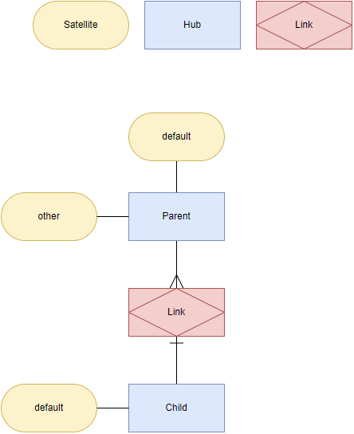

# Overview for Diagram **Ensemble2**:

## recognized shapes from b.telligent Shape Library:

|Shape ID|Shape Type|Label|
|--------|----------|-----|
|Ensemble2.7BRsjSB82dXbHQxhyXmk-1|Hub|Hub|
|Ensemble2.7BRsjSB82dXbHQxhyXmk-2|Satellite|Satellite|
|Ensemble2.7BRsjSB82dXbHQxhyXmk-3|Link|Link|
|Ensemble2.7BRsjSB82dXbHQxhyXmk-7|Hub|Parent|
|Ensemble2.7BRsjSB82dXbHQxhyXmk-8|Satellite|other|
|Ensemble2.7BRsjSB82dXbHQxhyXmk-9|Link|Link|
|Ensemble2.7BRsjSB82dXbHQxhyXmk-10|Hub|Child|
|Ensemble2.7BRsjSB82dXbHQxhyXmk-11|Satellite|default|
|Ensemble2.7BRsjSB82dXbHQxhyXmk-12|Satellite|default|

## recognized connections from b.telligent Shape Library:

|Source Type|Source Label|Connection Type|Label|Target Type|Target Label|Connection ID|Source ID|Target ID|
|-----------|------------|---------------|-----|-----------|------------|-------------|---------|---------|
|Satellite|default|Hub-to-Sat||Hub|Parent|Ensemble2.7BRsjSB82dXbHQxhyXmk-4|Ensemble2.7BRsjSB82dXbHQxhyXmk-12|Ensemble2.7BRsjSB82dXbHQxhyXmk-7
|Hub|Parent|Hub-to-Link-N||Link|Link|Ensemble2.7BRsjSB82dXbHQxhyXmk-5|Ensemble2.7BRsjSB82dXbHQxhyXmk-7|Ensemble2.7BRsjSB82dXbHQxhyXmk-9
|Hub|Child|Hub-to-Link-1||Link|Link|Ensemble2.7BRsjSB82dXbHQxhyXmk-6|Ensemble2.7BRsjSB82dXbHQxhyXmk-10|Ensemble2.7BRsjSB82dXbHQxhyXmk-9
|Hub|Parent|Hub-to-Sat||Satellite|other|Ensemble2.7BRsjSB82dXbHQxhyXmk-13|Ensemble2.7BRsjSB82dXbHQxhyXmk-7|Ensemble2.7BRsjSB82dXbHQxhyXmk-8
|Satellite|default|Hub-to-Sat||Hub|Child|Ensemble2.7BRsjSB82dXbHQxhyXmk-14|Ensemble2.7BRsjSB82dXbHQxhyXmk-11|Ensemble2.7BRsjSB82dXbHQxhyXmk-10
